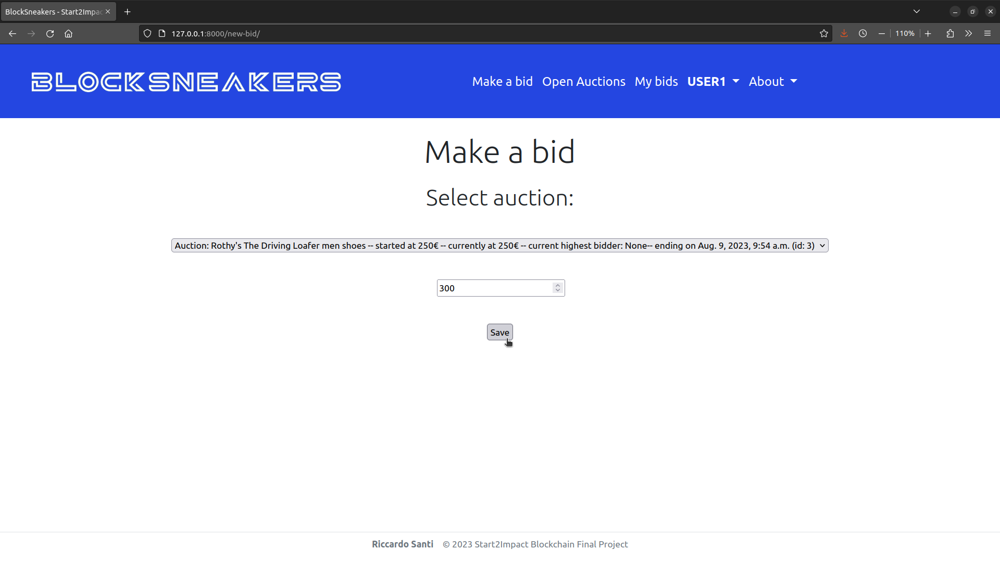

# Start2Impact Blockchain Final Project

    

This is my Blockchain Final project for [Start2Impact](https://talent.start2impact.it/profile/riccardo-santi).

### The main purpose of this project is to build an auction platform to sell limited edition shoes for an eco-friendly footwear company using Django, Redis and Web3PY.

BlockSneakers is an auction platform designed to sell limited edition shoes for an eco-friendly footwear company.
The platform allows users to register and log into the platform and gives a welcome bonus of 5000€ to every new user to start making bids. 
Customers can place bids on open auctions and easily monitor their wallet balance and won auctions.
When an auction concludes, BlockSneakers sends an Ethereum Sepolia transaction containg the sha256 hash of the auction JSON report.
BlockSneakers embraces transparent auctions, empowering users to independently verify results using the secure and immutable blockchain technology.

__Django__ is a powerful and popular Python based web framework for building web applications.
 
__Redis__ is an in-memory NoSQL database used for fast data storage and retrieval.
 
__Web3PY__ is a Python library that provides developers easy interaction with Ethereum blockchain.

## 📖Index

- [ 🚀 Main Features ](#mainfeatures)
- [ 🛠️ How to deploy ](#howtodeploy)
- [ 📈 Improved Skills ](#improvedskills)
- [ 👨‍💻 About me ](#aboutme)

## 🚀 Main Features: 

- #### A website homepage with a brief explanation of BlockSneakers

    

  

- #### A section where users can create a new account and log into the platform

    
    
    

  

- #### A dashboard page where users can see their wallet balance, their total bids and their total auctions won

    
    

  

- #### A page where anyone can see the list of open auctions 

    
    

  

- #### A page where customers can make bids on open auctions

    

  

- #### A page where users can see their bids made

    
    
    

  

- #### A page where anyone can see the list of closed auctions, with on-chain proof

    
    

  

- #### A page where users can see their auctions won, with on-chain proof

    

  

- #### The ability to adapt the website page and content to different types of devices to allow users to have always the best experience

    

  

## 🛠️ How to deploy

- Clone this repository in your local
- Be sure to have Python installed on your device, for this project i used Python 3.10.9.
- Be sure to have a Python IDE on board (I recommend [PyCharm](https://www.jetbrains.com/pycharm/))
- Open the program main directory in your IDE, open new terminal window and type `pip install virtualenv`
- Create a virtual environment by typing `python3.10  -m venv env` and activate it with `source env/bin/activate`
- Install program requirements by typing `pip install -r requirements.txt`
- Initialize the program database by typing `cd project`, `python3 manage.py makemigrations` and `python3 manage.py migrate`
- Create an admin user to start new auctions `python3 manage.py createsuperuser`
- Run the program by typing `python3 manage.py runserver`
- Enjoy BlockSneakers!

## 📈 Improved Skills
Python, [Django](https://www.djangoproject.com/), [Redis](https://redis.io/), [Web3PY](https://web3py.readthedocs.io/en/stable/), HTML & CSS

## 👨‍💻 About me
 &nbsp;&nbsp;

